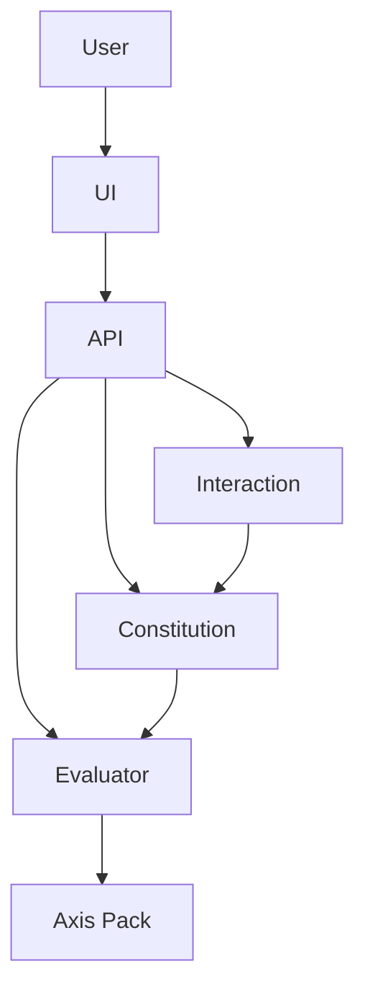

# Architecture

## System Overview

EthicalAI is an ethical evaluation layer built on top of Coherence, a semantic analysis engine for text embeddings and resonance.

The system operationalizes the objective "Maximize human autonomy based on objective empirical truth" through seven orthonormal ethical axes: virtue, deontology, consequentialism, autonomy, truthfulness, non-aggression, and fairness.

## Components

- **Axes**: Build and calibrate ethical axes from seed vectors, persisted as artifacts.
- **Eval**: Evaluate text by projecting onto axes, checking thresholds for veto spans, returning DecisionProof.
- **Constitution**: Decoding reranker that rejects veto candidates, ranks by autonomy/truth composite + LM logprob.
- **Interaction**: User-model interface with transparent proofs and safe alternatives.

## Data Flow

1. Build axis pack via API or CLI.
2. Calibrate thresholds on labeled datasets.
3. Evaluate text for veto.
4. Use in reranker or interaction for safe responses.

## Architecture Diagram

## Technologies

- Python backend with FastAPI.
- Sentence-transformers for embeddings.
- NumPy for vector operations.
- Streamlit for UI.
